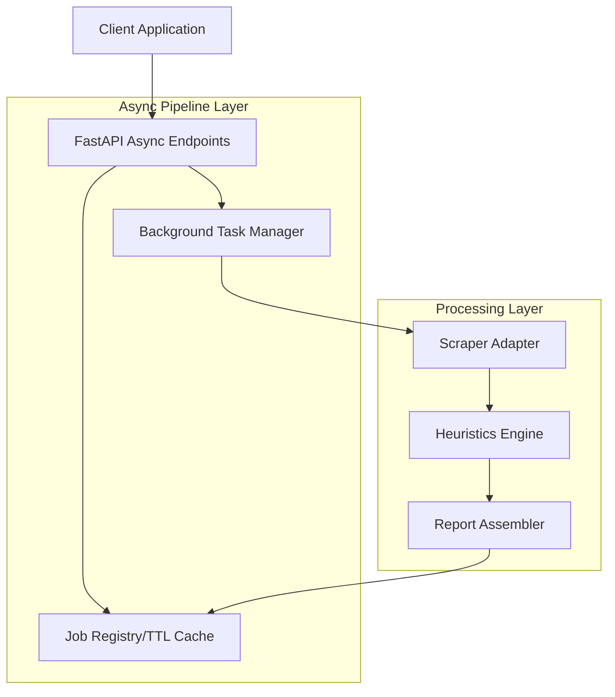
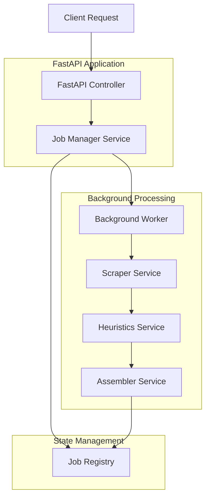
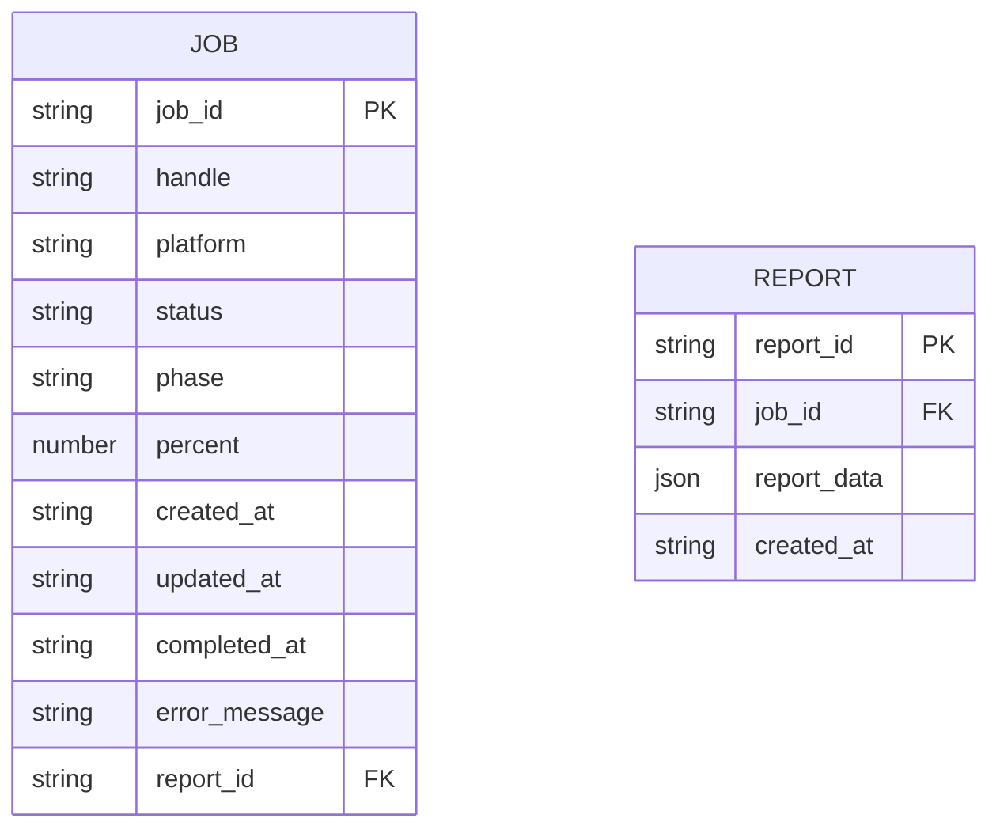

## 1. Architecture design



## 2. Technology Description
- **Backend**: FastAPI with async endpoints
- **Job Management**: In-process dict/TTL cache or Redis for job state
- **Background Processing**: FastAPI BackgroundTasks or Celery
- **API Framework**: FastAPI with Pydantic models
- **Existing Components**: Reuse current scraper adapters, heuristics, and assembler

## 3. Route definitions
| Route | Purpose |
|-------|---------|
| POST /api/analyze | Submit new analysis request, returns job ID |
| GET /api/status/{job_id} | Get current job status and progress |
| GET /api/report/{job_id} | Retrieve completed analysis report |
| GET /health | Health check endpoint (existing) |

## 4. API definitions

### 4.1 Analysis Submission API
```
POST /api/analyze
```

Request:
| Param Name | Param Type | isRequired | Description |
|------------|-------------|-------------|-------------|
| handle | string | true | Social media handle to analyze |
| platform | string | false | Platform (instagram/tiktok/youtube), defaults to instagram |

Response:
| Param Name | Param Type | Description |
|------------|-------------|-------------|
| job_id | string | Unique identifier for the analysis job |
| status | string | Job status ("accepted") |

Example:
```json
{
  "handle": "example_user",
  "platform": "instagram"
}
```

Response:
```json
{
  "job_id": "550e8400-e29b-41d4-a716-446655440000",
  "status": "accepted"
}
```

### 4.2 Status Check API
```
GET /api/status/{job_id}
```

Response:
| Param Name | Param Type | Description |
|------------|-------------|-------------|
| job_id | string | Job identifier |
| status | string | ScrapeStatus (pending/processing/completed/failed) |
| phase | string | Current processing phase ("Scraping"/"Analysis"/"Finalizing") |
| percent | number | Completion percentage (0-100, optional) |
| created_at | string | ISO timestamp of job creation |
| updated_at | string | ISO timestamp of last status update |

Example:
```json
{
  "job_id": "550e8400-e29b-41d4-a716-446655440000",
  "status": "processing",
  "phase": "Analysis",
  "percent": 65,
  "created_at": "2024-01-17T10:00:00Z",
  "updated_at": "2024-01-17T10:00:30Z"
}
```

### 4.3 Report Retrieval API
```
GET /api/report/{job_id}
```

Response: ReportResponse model (existing structure)

## 5. Server architecture diagram



## 6. Data model

### 6.1 Job State Model


### 6.2 Data Definition Language

Job Registry Table (for TTL cache implementation)
```python
# In-memory structure with TTL
job_registry: Dict[str, JobState] = {}

class JobState:
    job_id: str
    handle: str
    platform: str
    status: ScrapeStatus
    phase: str
    percent: Optional[int]
    created_at: datetime
    updated_at: datetime
    completed_at: Optional[datetime]
    error_message: Optional[str]
    report_data: Optional[ReportResponse]
```

Redis-based implementation (alternative)
```
# Redis key structure
jobs:{job_id} -> Hash with job state
jobs:{job_id}:report -> JSON report data (when completed)
jobs:handle:{handle}:{platform} -> job_id (for deduplication)
```

### 6.3 Implementation Requirements

**Idempotency**: Use handle+platform composite key for deduplication
**TTL Management**: Completed jobs expire after 24 hours
**Error Handling**: Retry with exponential backoff for failed jobs
**Memory Management**: Automatic cleanup of old job states
**Concurrency**: Thread-safe job state updates

### 6.4 Background Worker Flow
```python
async def process_job(job_id: str, handle: str, platform: str):
    # 1. Update status to PROCESSING
    # 2. Scraping phase (30%)
    # 3. Analysis phase (60%)
    # 4. Finalizing phase (10%)
    # 5. Store completed report
    # 6. Update status to COMPLETED
```