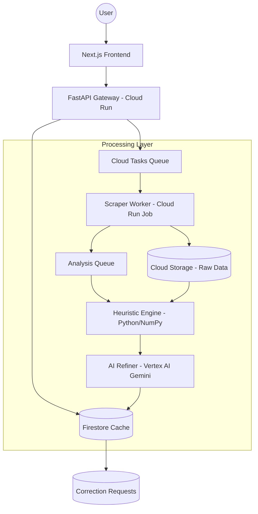

# System Design Document: SponsorScope.ai

**Version:** 1.1  
**Status:** Final - Incorporating Structural Improvements  
**Architecture Style:** Serverless Microservices (GCP Native)

---

## 1. High-Level Architecture
SponsorScope.ai uses a decoupled, event-driven architecture designed for **graceful degradation** and **hybrid analysis** (Heuristics + LLM).

### 1.1. Architecture Diagram

## 2. Component Breakdown

### 2.1. Frontend (Next.js)
*   **Role:** User interface with **Epistemic Guardrails**.
*   **Key Features:**
    *   **Uncertainty Visualization:** Render scores with confidence bands (e.g., 85 ± 3).
    *   **Context Banners:** Display "Research Context" and "Data Freshness" warnings.
    *   **Degradation UI:** Clearly label reports as "Partial" or "Archival" based on `data_completeness` flags.

### 2.2. API Gateway (FastAPI)
*   **Role:** Entry point and **Governance Manager**.
*   **Logic:**
    *   Manages the **Correction Log** API for public feedback.
    *   Handles versioned methodology routing.
    *   Provides `data_completeness` status during polling.

### 2.3. Scraper Worker (Playwright)
*   **Role:** Resilient data ingestion.
*   **Resilience Logic:**
    *   **Graceful Exit:** If a platform blocks media/comments, the scraper completes the job with available data and sets the `data_completeness` flag.
    *   **Stealth:** Rotates User-Agents and viewports; implements exponential backoff.

### 2.4. Hybrid Analysis Engine
*   **Phase 1: Heuristic Engine (Deterministic):**
    *   Calculates baseline scores using hard math (e.g., engagement ratios, comment entropy).
    *   Establishes the "Bot Probability Floor".
*   **Phase 2: AI Refiner (Gemini 1.5 Flash):**
    *   Processes nuance (slang, image context).
    *   Adjusts heuristic scores within a ±15% range to maintain determinism.
    *   Generates the `confidence_score`.

## 3. Data Flow: Resilient Scan Sequence
1.  **Request:** User searches for `@handle`.
2.  **Tasking:** API enqueues `scrape_task`.
3.  **Scraping:** Scraper worker fetches what it can. If comments are blocked, it flags `partial_no_comments`.
4.  **Heuristics:** Engine calculates baseline scores based on available data.
5.  **Refinement:** Gemini refines scores and flags "Text-only" if images are missing.
6.  **Delivery:** Frontend renders the report with a "Partial Data" warning and confidence intervals.

## 4. Governance & Calibration
*   **Regional Calibration (Botswana):** A subset of 100 "Ground Truth" profiles is used to calibrate the Heuristic Engine's thresholds.
*   **Methodology Versioning:** All scoring logic is encapsulated in versioned Python modules (e.g., `scoring/v1_1.py`).
*   **Public Auditability:** The `/methodology` endpoint serves the exact weights and heuristic formulas used for the current version.

## 5. Cost & Scaling
*   **Scale to Zero:** Fully serverless stack.
*   **LLM Optimization:** Heuristics reduce the token count needed for Gemini by providing pre-processed summaries.
*   **GCS Lifecycle:** 30-day auto-deletion of raw data.

## 6. Legal & Reputational Posture
*   **Algorithmic Neutrality:** By using a hybrid model (Heuristics + LLM), the system can defend its scores as being based on empirical data rather than "black box" AI judgments.
*   **Transparency:** The correction log and public methodology provide a structural defense against claims of bias.
